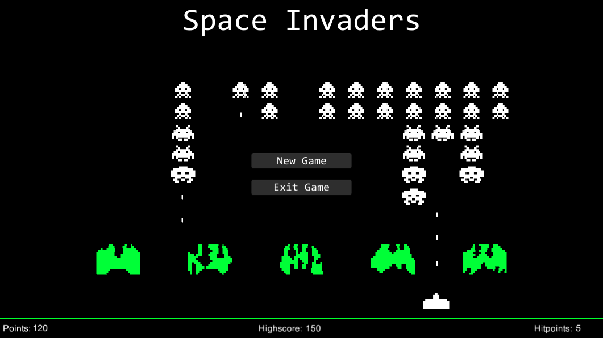
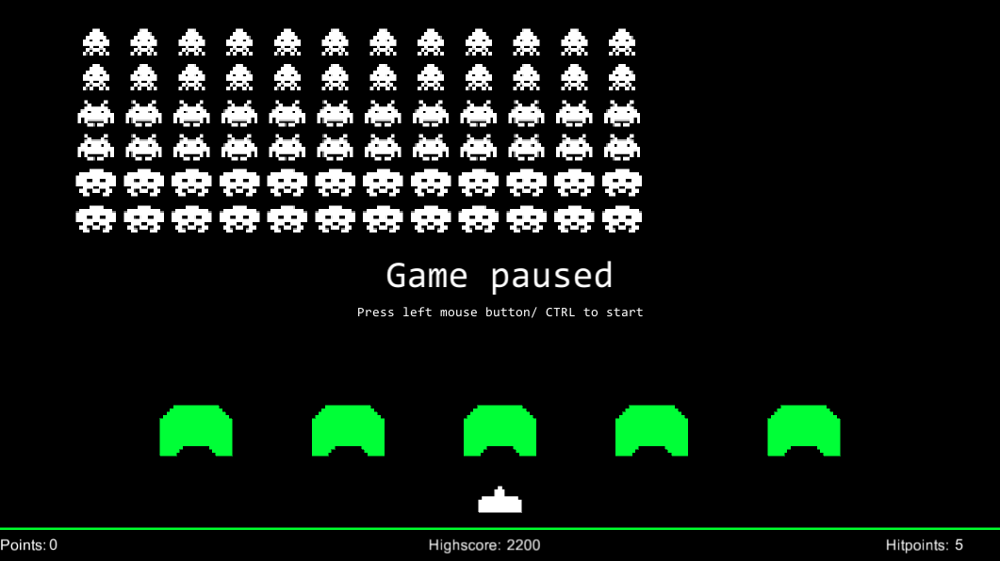
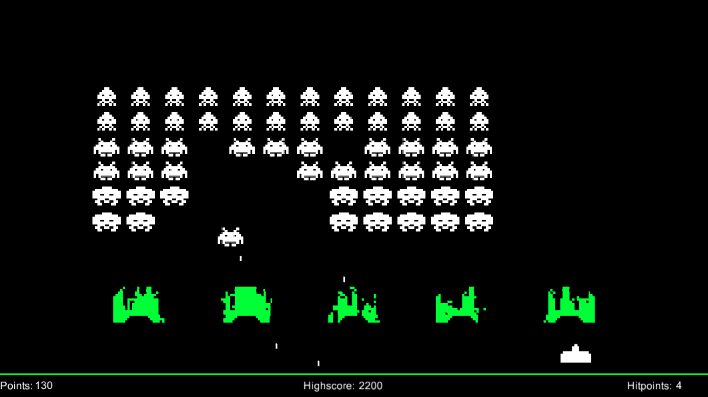
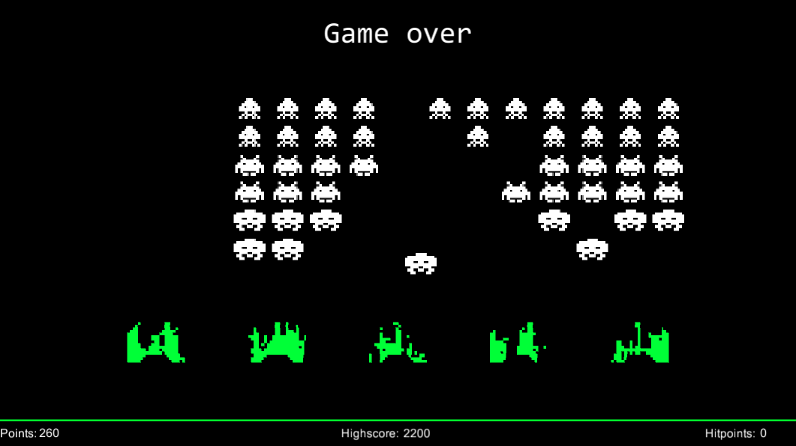

# Space-Invaders
Simple arcade game <i>Space Invaders</i> created with Unity3D.  
Used Unity3D version: 5.3.1f1

## Game
Space Invaders is an arcade video game developed by Tomohiro Nishikado and released in 1978. Space Invaders is one of the earliest shooting games and the aim is to defeat waves of aliens with a laser cannon to earn as many points as possible. [Wikipedia](https://en.wikipedia.org/wiki/Space_Invaders)

## Screenshots

        
        
        </img>
        
        </img>
        
        </img>

